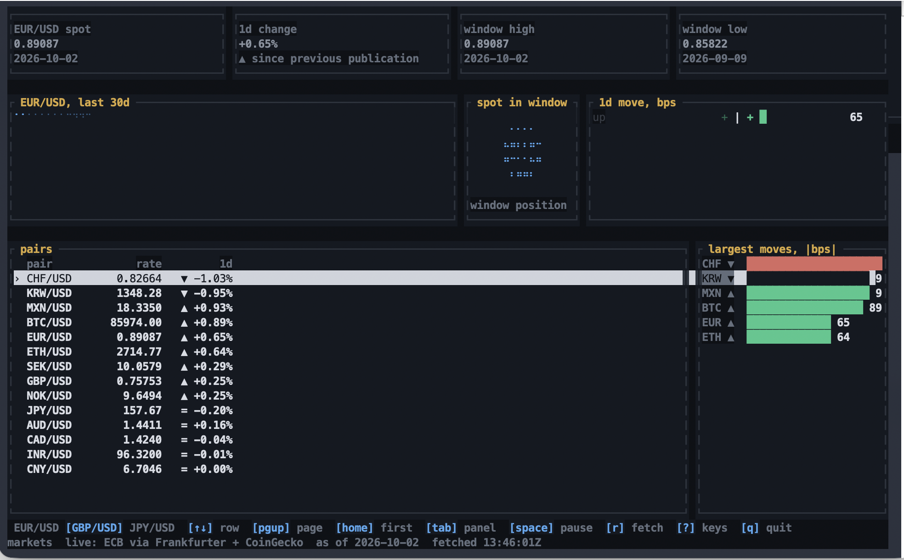

# TermMosaic

[](https://pkg.go.dev/github.com/serkanalgur/termmosaic)
[](https://github.com/serkanalgur/termmosaic/actions/workflows/ci.yml)
[](https://github.com/serkanalgur/termmosaic/actions/workflows/ci.yml?query=job%3Agofmt)
[](https://github.com/serkanalgur/termmosaic/actions/workflows/ci.yml?query=job%3Agolangci-lint)
[](LICENSE)
[](go.mod)

A terminal UI framework for Go: a cell-buffer renderer, a catalog of
ready-to-use widgets, and a command/keymap layer that binds keys to named
actions without changing a single widget signature.

> **Status: pre-alpha.** The renderer, input layer and the full widget catalog
> are built and tested — 25 packages, 966 tests, zero-allocation frame path —
> but the API is **not stable** and may break before v1.0.
>
> **Supported platforms: Linux and macOS.** Windows is a deliberate loud-error
> stub — every console operation fails loudly instead of half-working — and a
> Windows console backend is out of scope for v1.0.0
> ([ADR 0001](docs/adr/0001-backend-strategy.md); decision recorded in
> [docs/STATUS.md](docs/STATUS.md)).
>
> See [docs/STATUS.md](docs/STATUS.md) for what is decided, proposed and open,
> and [docs/adr/](docs/adr/) for the reasoning behind each decision.

## Why this exists

The Go TUI ecosystem has exactly one dominant framework, and it leaves a lot
on the table:

- **Ink** (TS/React) clears and repaints the whole screen on each update. It
  works until your app gets big, then input lag becomes obvious.
- **OpenTUI** is a strong engineering artifact with a deliberately unfinished
  surface: at 13.4k stars and running in production, it ships **no
  progressbar, gauge, sparkline, bar chart, or meter**, and **no list, tree,
  pager, or virtual scroll**. Its roadmap still lists data virtualization as
  unfinished.
- Terminal.Gui and friends predate the modern bar and carry decades of
  accumulated baggage.

TermMosaic's bet is narrow and specific: **the widget catalog is the product.**
A framework nobody can build a real dashboard on is a toy, regardless of how
elegant its renderer is.

## Design pillars

1. **A complete widget catalog.** Thirty-plus widgets covering layout, forms,
   data, and visualization — the things real tools need.
2. **Data virtualization from day one.** List, Table, and Tree render 100k+
   rows at interactive speed. Not a future roadmap item.
3. **Honest rendering.** A double-buffered cell buffer with two-tier diffing
   (row-level skip, then per-cell), dirty-region tracking, and a 30–60 fps
   frame budget. No full-screen clears in the hot path.
4. **Graceful degradation.** Truecolor → 256 → 16 color. Unicode borders →
   ASCII. `NO_COLOR` respected. Mouse capture is **off by default** because it
   steals selection and scrollback from your shell. tmux DCS passthrough is a
   known gap — see [docs/STATUS.md](docs/STATUS.md).
5. **Testable without a terminal.** A headless memory-sink backend means the
   renderer and every widget are unit-testable in CI.
6. **Accessible by construction.** Color is never the only signal. Visible
   focus. Full keyboard operation. (A reduced-motion flag is **not** built
   yet — the catalog animates nothing today, so there is nothing to gate.)
7. **Documented limits.** Known limitations are written down, not discovered
   by users. If we have no IME support, the README says so.

## Installation

Tagged and released through **v0.5.2**. Pin the version:

```
go get github.com/serkanalgur/termmosaic@v0.5.2
```

## What's in the box

**24 widgets**, built and tested:

| | |
|---|---|
| **Core** | `Block` `Text` `Paragraph` `Split` |
| **Forms** | `TextInput` `TextArea` `Select` `Checkbox` `Radio` `Toggle` `Tabs` `Button` `KeyHint` |
| **Data** | `List` `Table` `Tree` `Pager` + the `virtual/` engine |
| **Visualization** | `ProgressBar` `Gauge` `Meter` `Sparkline` `BarChart` |
| **Navigation & modality** | `Menu` `Dialog` |

`buffer.Buffer` is not on that list and is not a `Widget` — it has no `Bounds`,
`Draw` or `Handle`. It is what widgets draw into.

### Commands and key bindings

`keymap` is a separate package, not a widget, and it sits **above**
`Widget.Handle` rather than inside it — `termmosaic.Widget` is still four
methods and has never changed.

- One named action, reached by a key **or** a menu item **or** application
  code. A key that resolves to nothing falls through to the tree exactly as
  before.
- `ctrl+k` and `Ctrl+K` are **two** chords — Shift is folded into the rune, and
  a kitty terminal reports them as two gestures. Modifiers are parsed
  case-insensitively, and `Space` and a literal space are one chord.
- Resolution is **focus > screen > global**, with no numeric priority. A
  screen's own `Esc` cannot be stolen by a global binding; a user's override
  wins within its own scope.
- **0 allocations** on the dispatch path. `Chord` is a comparable 16-byte
  struct, so resolution is a map lookup — pinned by
  `TestDispatchIsZeroAllocation`, not merely intended.
- Help is derived from the bindings, so a help row cannot drift from what the
  key actually does. `Describe()` gives one row per **chord**, which is what a
  help screen and a command palette want; `DescribeGrouped()` gives one row per
  **command**, which is what a one-line `KeyHint` wants.
- Widgets participate **optionally**, via `keymap.Commandable` and
  `keymap.Clickable`. No catalog widget implements either yet, and there is no
  command palette — both are deliberate, with triggers recorded in
  [ADR 0009](docs/adr/0009-command-and-keymap.md).

Two examples use it, of four. [`examples/hello`](examples/hello) dispatches
through a real `keymap.Registry` — six commands, twelve chords — and renders both
its pinned hint line and its `?` help overlay from that registry rather than from
hand-written strings. [`examples/search`](examples/search) is the first to put a
**focusable** widget in a focus ring: a `TextInput` and a `Table`, with
`Tab`/`Backtab` moving between them, and every context-dependent binding gated by
`Command.Enabled` rather than by `ScopeFocus` — because `Enabled` false makes
`Dispatch` skip the command and fall through to the tree, which is what keeps a
binding from taking a key away from the widget that has focus. `markets` and
`dashboard` still dispatch by their own `switch`.

The absence of `Commandable` in the catalog is therefore not blocking either of
them: an application can have a fully registry-derived key contract without it.
What is still missing is `Registry.SetFocus`, which `examples/search` works around
by tracking focus itself and filtering its hint on `km.Has` — the one query an
application makes when focus changes is the one it cannot make.

Per-frame cost is flat in item count — this is the claim the catalog exists to
back up:

| Items | `List` | `Table` |
|---|---|---|
| 10,000 | 13,320 ns | 16,801 ns |
| 100,000 | 14,242 ns | 17,885 ns |

Ten times the data for seven percent more time, at zero allocations. Run
`examples/markets` to see it against a real 100k-item list.

## Examples

```
go run ./examples/hello       # a responsive bordered panel; '?' for help
go run ./examples/markets    # a live finance dashboard on real ECB data
                           # add --offline to run without a network
go run ./examples/search      # Wikipedia search and results, no API key
                            # add --offline to run on a bundled capture
```

`examples/markets`, on live ECB and CoinGecko data:



One `Block` per region, a `Split` down the middle, a `Table` over the
`virtual` engine, and the chart types doing the work the catalog exists for. The
selected row is drawn with `SelectedStyle` in **both** the row background and
the cell text — see [v0.5.1](CHANGELOG.md), which fixed the case where it
reached only the background.

## Documentation

**[📖 Full documentation →](https://serkanalgur.github.io/termmosaic.github.io/)** — guides, concepts, and a page per widget with real rendered captures at three widths.

- [docs/STATUS.md](docs/STATUS.md) — current state of the design
- [docs/adr/](docs/adr/) — the ten architecture decisions, with the reasoning
- [docs/CONTRIBUTING.md](docs/CONTRIBUTING.md) — how to help
- [CHANGELOG.md](CHANGELOG.md) — release notes, including known limitations

Every screenshot on the documentation site is a real render, generated by
`cmd/capture` through the same headless path the tests use — so a page cannot
show output the code does not produce.

## License

MIT

## Sponsoring

This is a solo pre-alpha project and it costs real time. If it saves you any,
[GitHub Sponsors](https://github.com/sponsors/serkanalgur) is the way.

Sponsoring does not buy priority, a roadmap seat, or a promised feature — the
architecture decisions are made in the open, in `docs/adr/`, and that will not
change.

## Acknowledgements

This project studies and is informed by the work of
[Ratatui](https://github.com/ratatui/ratatui),
[Bubble Tea](https://github.com/charmbracelet/bubbletea),
[Textual](https://github.com/Textualize/textual), and
[OpenTUI](https://github.com/anomalyco/opentui).